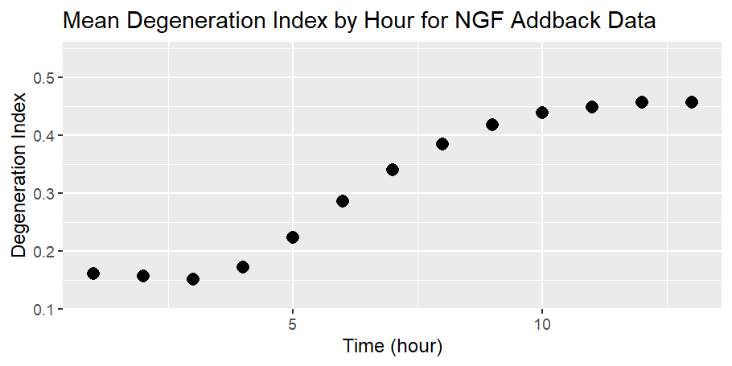

 **Analyze Nerve Growth Factor (NGF) deprivation in axonal degeneration**

This is for the course BIO:4386 Intro to Scientific Computing in the Spring of 2023. This aims at recreating the graph from the unpublished data behind the NGF Deprivation Experiment (Dr. Daniel Summers Lab). 

**Introduction**

Alzheimer's disease is one of the most common forms of dementia. It is onset by multiple factors but most commonly seen in loss of neuronal connectivity due to axonal degeneration. While there are many factors of neurodegeneration, our lab studies the mechanism for loss of axonal connectivity termed Wallerian degeneration. Wallerian degeneration refers to physical damage inflicted on an axon that induces degeneration. This physical damage causes anterograde degeneration, i.e., degeneration towards the distal axon terminal. This is distinguished from  retrograde degeneration, which is when degeneration occurs towards the proximal cell body. The effects of the two degeneration are different only in terms of where the degeneration starts and the direction it goes in. Despite physical damage in axons being uncommon, Wallerian degeneration is still very similar to how axons react when undergoing a traumatic injury in the central nervous system and an efficient model for our lab. 

An image collected from ImageJ of healthy axons, notice the thicker, brighter, stronger axons in the image.

An image collected through ImageJ of unhealthy axons showing signs of degeneration through thinner lines, degraded areas, and the axons beginning to shrivel as they fall apart.

 Anterograde degeneration is seen in different peripheral neuropathies and diseases and is the cause for diseases such as Alzheimers and/or ALS. For this experiment, our goal is to look at how anterograde degeneration induced by Wallerian degeneration is affected by either having, or not having  supplemental Nerve Growth Factor (NGF) added. NGF is a protein that promotes cell growth. NGF has many important regulatory functions in nerve cells in the peripheral and central nervous system. It is normally added to cells while being cultured to help them survive. To induce the Wallerian Degeneration, the axons are cut just slightly above the soma. This cut is the traumatic injury that the cells will undergo. For this study, we are looking to see if NGF has an influence on neuron cell death or survival during Wallerian Degeneration. Since NGF is a neuron survival factor that we normally add while culturing the cells to promote cell growth due to its regulatory functions, we want to study the effect NGF can have on axons. Our hypothesis for this experiment was to see if there is an increase of growth in axons that have started to degenerate from physical damage when they have been deprived of NGF and had NGF added back to it later. NGF is not normally produced after injury, so this is to test for a possible repair mechanism.

From there we can take images of the cells and run the images through a protocol that can quantify the amount of degeneration that occurs in the cells using ImageJ. To do this, there is a protocol our lab uses that analyzes the amount of area from the image, and calculates how much of the cell is taking up the area. As the axons die and degenerate, they break down and take up less area in the visual field of the image. The protocol quantifies a number for this, and while not perfect it does provide a quantifiable way of assessing the data rather than a qualitative method. Degeneration indexes under .3 are seen as not undergoing severe degeneration and images quantified at a degeneration index of over .3 are seen as undergoing severe degeneration. Cells have their own internal production of NGF and in  Wallerian Degeneration the production of NGF is upregulated. NGF is necessary and supports the survival of these neurons. While some amount of NGF is necessary for neuron survival, we would expect that with NGF deprivation to see more apoptosis in the neurons of these conditions and in the surplus addition of NGF that there would be better survival rates in neurons (Rotshenker S., 2011). We would expect to see a spike in the amount of degeneration in the NGF deprived condition in comparison to the not deprived NGF condition because without the deprivation, the cells are still receiving growth support from the NGF.

    

 Fig. 1 Axon Degeneration Post Axotomy for Different Conditions. This figure shows the amount of Axon Degeneration scored on the degeneration index between 0.0-1.0 with scores above 0.3 to be considered undergoing induced/severe degeneration rather than normal cell decay. Along the X- axis is the hour post axotomy of the cells. Three variables are present, the control being the non NGF deprived cell cultures, NGF deprived cultures and NGF that was deprived and later added back to the cells.

 This figure really addresses the question behind what can NGF do, as well as what influences axonal degeneration. While it would have been expected that cultured cells deprived of NGF would have higher axonal degeneration (above .3 in the degeneration index) because NGF, a cell growth promoting protein, normally supports cell growth. It was found that the NGF deprivation would in fact lower the amount of axonal degeneration, and slow down the rate of degeneration compared to other groups such as the control group and the NGF addback group While unsure for the the reasoning behind the unexpected results the current hypothesis for why it occurred is that NGF may play a role in other areas that encourage axon survival and regeneration such as in the tropomyosin receptor kinase TrkA. TrkA is in the soma and is known to be triggered specifically by NGF. Once Trka is triggered, it leads to a cascade of signaling events such as Nmnat2, an enzyme that has neuroprotective properties and that inhibits SARM1. Sarm1 is a protein that when inhibited has been shown to promote axon survival and degeneration.

  **Materials and Methods**
While preparing cell cultures to undergo Wallerian degeneration, first dorsal root ganglions (DRG’s) are collected from mouse embryos and cultured in Neurobasal Media (10 ml) with added B27 (10 ul), Nerve Growth Factor (20 ul), and FdU (20ul).Cells are incubated for seven days. The cultured cells are then given a physical insult with a razor blade on the axons near the soma. Neurobasal, NGF, B27, and FdU are always added in these concentrations for all three conditions.

There are three conditions being tested, first, there is the NGF deprivation condition that is cultured with NGF, washed at DIV7 and then deprived of NGF for 4 hours, where it is kept in the Neurobasal Media and added B27 without the added NGF, and then an axotomy is performed. There is a second condition where the cells are cultured with NGF and then washed, NGF is added, and then four hours later an axotomy is performed on the cells. And then there is a third condition where the cells are cultured with NGF, washed and and deprived of NGF for four hours, and then NGF is reintroduced into the cells before performing the axotomy. The intention with this experiment is to see how soon degeneration goes into effect after the axons are cut, and if there is more or less degeneration without NGF.

Images are taken promptly after, collecting data for axon degeneration at each time point for 13 hours. The collected data is for eight visual fields of each well, to be averaged to make up for the possibly differences in amount of axon density in each well.

  **Data**

 Data was given in a .csv file from Dr. Summers. Data for only the NGF addback group is uploaded to github repo with an annotated file explaining how the data will be wrangled to proceed in making the figure.

1. Access the github repo through the link: [https://github.com/Intro-Sci-Comp-UIowa/biol-4386-course-project-maddemir](https://github.com/Intro-Sci-Comp-UIowa/biol-4386-course-project-maddemir) 
2. Click on the data folder
3. Click on the DWS 121 NGF addback Bclxl timecourse.csv file
4. You’ll see the file pull up, and we will focus on the columns listed as filename as well as degeneration index.

   **Methods:**

 My end goal with this project is to find an efficient way of organizing data and using data wrangling techniques so that it an be reproducible/usable by others in my lab. I would like to also incorporate calculating the averages of the degeneration index for each well and each hour in the timecourse using all eighth visual fields in each well.

    Filename: 

        	    	

    Well	Visual field number	Hour #

    Well A10

* Visual field 1
    * Images for hours 1-13
* Average deg index for hour 1 from all 8 visual fields 
* Repeat for all 13 hours

  To achieve this, I will be taking the raw data from a figure with three variables and focusing on one variable; NGF addback. My goal is to write a code through R/R studio to take the data after it has been quantified into a .csv file. Example using columns from .csv file visual fields 1-2 for well A10 (there are eight visual fields, only used two in this example)

Step 1: Using R, I will separate all wells, A10, A11, A12 etc .

Step 2: There are eighth visual fields for each well. In each visual field there is an image taken for hours 1-13 

Step 3: I will take the average of all the images for each hour from all the visual fields. 

Step 4: Creating a visual of the means

Step 1. Here all of the A10 wells are grouped together

Step 2 . Visual fields have been separated 

Visual field 1:

Visual field 2:

Avg hour 1 in well A10: (.6226+.6106)/2 = .61660

Avg hour 2 in well A10 :(.5933+.6144)/2 = .60385

Continue until hour 13

**Producing the figure details**

**# So first i’m getting everything set up, so im making sure I have the package I need, and I am importing the data into a tibble, skipping the first line of the csv file so that it would be tidy, as well as renaming one of the columns.**

require(tidyverse)

df &lt;- read_csv("DWS 121 NGF addback Bclxl timecourse.csv", 

               col_types = cols(), skip = 1) %>% 

  rename(area = "Area analyzed")

**#Next up, its time to tidy up the data some more, here I am separating one column into multiple different columns, creating new columns, and modifying the contents of the set for the columns that I am interested in.**

df1 &lt;- df %>% 

  separate(filename, into = c('well', 'uuf1', 'uuf2', 'vf', 'marker', 'hour'),

           sep = "_") %>% 

  mutate(hour = str_replace(hour, ".tif", "") %>% as.numeric()) %>% 

  select(well, vf, hour, index = "degeneration index")

**# Next I am creating a new array with the contents I am interested in. This means I am looking at visual fields 1-8, and looking for hours 1-13. I am grouping this content by both the well and the hour. I am then finding the mean of the degeneration index for all eight visual fields of each hour for each well. I’m setting this to generate all the means for the entire data sheet.**

df1_mean &lt;- df1 %>%

  filter(vf %in% 1:8, hour >= 1, hour &lt;= 13) %>%

  group_by(well, hour) %>%

  summarize(mean_index = mean(`index`))
print(df1_mean, n = 198)

**# Last up is to create a scatter plot with all these means, so that it is averaging all the wells and plotting the degeneration index by hours 1-13 on the x-axis.**

ggplot(df1_mean, aes(x = hour, y = mean_index)) +

  geom_point(stat = "summary", fun.y = "mean", size = 3, shape = 16) +

  labs(x = "Time (hour)", y = "Degeneration Index", title = "Mean Degeneration >

**Results section:**

    

 Fig. 2 This figure shows the amount of Axon Degeneration scored on the degeneration index between 0.0-1.0 with scores above 0.3 to be considered undergoing induced/severe degeneration rather than normal cell decay. This figures averages the means for all the wells in the data set and plots them  long the X- axis is the hour post axotomy of the cells. This figure has only one condition present, the condition where cells were deprived of NGF  for four hours and later had NGF added back to the cells.

 While some degeneration is expected because cells will naturally die, degeneration past .3 on the degeneration index implies that the amount of degeneration is more than the typical expected degeneration. The figure shows that the degeneration amount increases most between hours 5-10 and evens out after 10 hours at .5 degeneration. While the increase in degeneration would not have been expected, the plateau is not abnormal because after cells have reached a certain amount of degeneration the amount of degeneration tends to stay constant.

**Discussion:**

I felt that this figure was the perfect project and level of difficulty for this project and overall course. I was able to get all of the data wrangling done, creating the figure was not too difficult once I got some direction. The biggest discrepancy between the figure I produced and the original figure is that the figure that I produced has only one condition graphed. It only has the NGF addback condition graphed while the original figure has the other conditions also graphed. In the future, I would like to use the other data files and figure out a way to graph all the conditions in the same figure.

**Conclusion:**
This project was successful in that the figure was able to be reproduced and a code was written through R studio to not only wrangle the data but also create a comprehensive graph. The project was especially successful because the code that was written for this data set can be slightly altered to be used with other data. Focusing on the realm of the NGF experiment, the results from the data are unexpected since there was continued axon degeneration after NGF addback rather than axon degeneration rescue, indicating that NGF may play multiple roles in the mechanism such as with the TrkA inhibitor. These findings emphasize the significance of careful data analysis and code development to ensure the reproducibility and robustness of scientific research.
